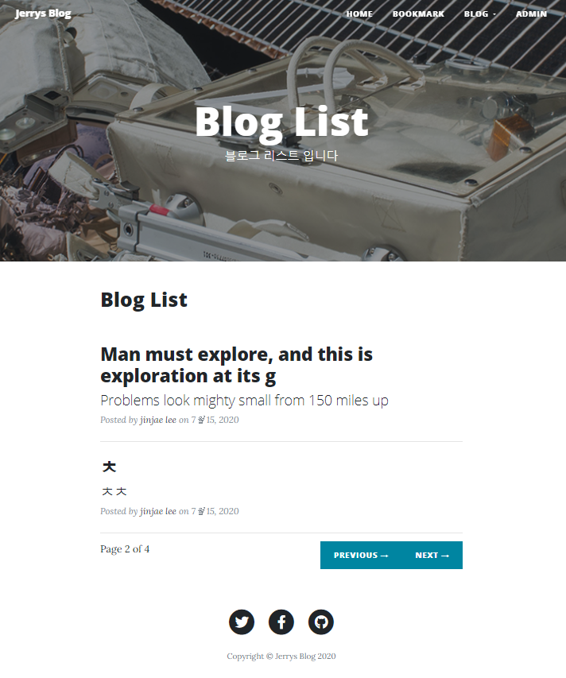

# django-project
 장고를 공부해봅시다.  

[Django Blog 정리 링크](https://www.notion.so/loftmain/Django-99b22afdfed545f2b6ca2f508e37c4a5)  
\* 계속 추가할 예정입니다^\*^

## 현재 진행상황
- 20200714 기본 form 구현  
- 20201714 bookmark 구현  
- 20200715 tag 기능을 구현
- 20200715 댓글 기능 구현
- 20200716 search 기능 구현
- 20200716 photo 사진첩 기능 구현
- 20200716 login/logout 인증기능 구현
- 20200717 bookark, blog 편집기능 구현  
- 20200717 photo album 편집기능 구현

__main__
    

__bookmark__
  

